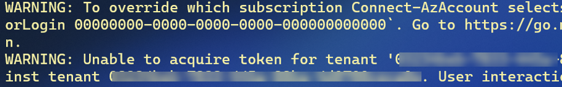
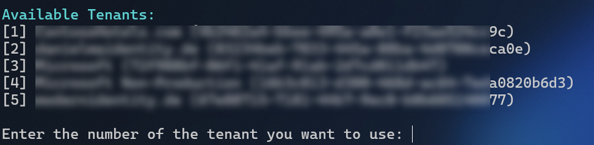
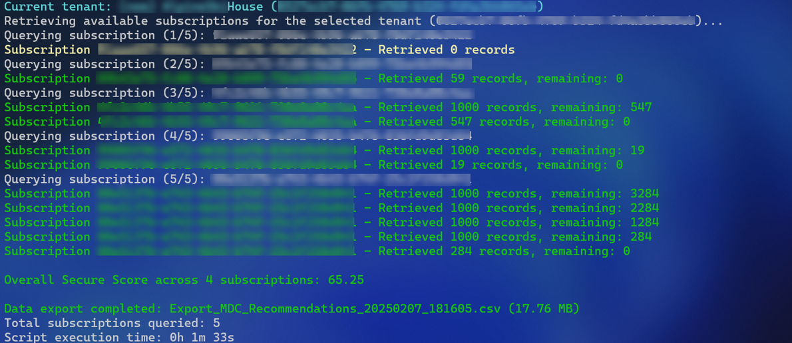

# Enterprise Security Assessment – Data Gathering Script

This repository contains the necessary files for collecting security and compliance data as part of an Enterprise Security Assessment (ESA). The included scripts and configuration files are used to extract Defender for Cloud recommendations for both:

- **MDC (Microsoft Defender for Cloud Secure Score Recommendations)**
- **MCSB (Microsoft Cloud Security Benchmark – Regulatory Compliance)**

## Contents

| Filename                | Purpose                                                                 |
|-------------------------|-------------------------------------------------------------------------|
| ESA_MDC_DataExport.ps1  | PowerShell script that downloads Defender for Cloud recommendations (MCSB regulatory compliance and MDC Secure Score recommendations.) |
| MDC_Params.json         | Parameter file containing export settings for MDC.                      |
| MCSB_Params.json        | Parameter file containing export settings for MCSB.                     |
| MDC.kql                 | The KQL (Kusto Query Language) query executed by the script for MDC.    |
| MCSB.kql                | The KQL (Kusto Query Language) query executed by the script for MCSB.   |


## Required PowerShell Modules

> ⚠️ The script has only been tested with PowerShell 7.x.


This script requires the following Azure PowerShell modules:

- `Az.Accounts`  
- `Az.ResourceGraph`

The script checks for the required Azure PowerShell modules. If any are missing, it will notify you and provide installation instructions:
```powershell
Install-Module Az.Accounts, Az.ResourceGraph -Force
```

## Usage

To run the script, pass the path to a JSON parameter file:

```powershell
.\ESA_MDC_DataExport.ps1 <ParameterFile>

.\ESA_MDC_DataExport.ps1 MDC_Params.json
.\ESA_MDC_DataExport.ps1 MCSB_Params.json
```

If you run the script without any parameters, a help message will be displayed.

To export both MDC and MCSB data, run the script twice - once with each parameter file.

**Retry Logic:** The script uses *exponential backoff* retry logic to handle transient errors, retrying failed calls with delays of up to 28 seconds. Status messages are shown during retries.

**Error Logging:** If any errors occur during the execution of the KQL query, they will be logged in a file with the `.failed` extension.


## Execution

If there is an existing Azure session you may proceed with it or select ‘N’ to re-authenticate:


You may see yellow warning messages after authentication. These can be ignored!




If you have access to multiple tenants, you will be prompted to select the desired tenant.



In the following example, 5 subscriptions were queried, and data was exported for 4 of them.  
The missing subscription (Yellow) was likely due to lack of access or other reasons.  
**This is not an error.**  
Depending on the number of subscriptions and the size of the data sets, the script may run for multiple hours.  
**The script calculates the overall secure score across the subscriptions at the end.**



# Script Parameter File: `MDC_Params.json`

This JSON file defines input parameters for the `ESA_MDC_DataExport.ps1` script when exporting **MDC secure score recommendations**.

```json
{
  "CSVFileName": "Export_MDC_Recommendations.csv",
  "QueryFile": "MDC.kql",
  "SubscriptionIds": ["*"],
  "_comments": {
    "CSVFileName": "Final CSV output file for Power BI import",
    "QueryFile": "KQL Query file. Do not change!",
    "SubscriptionIds": "Comma-separated subscription IDs or '*' for all available subscriptions. If you specify specific subscriptions, ensure you connect to the correct tenant (if you have access to multiple tenants) during script execution. If you don't have access to some subscriptions, the script will continue with the remaining ones."
  }
}
```

| **Parameter**     | **Description**                                                                                                                                                                                                                                                                            |
|-------------------|--------------------------------------------------------------------------------------------------------------------------------------------------------------------------------------------------------------------------------------------------------------------------------------------|
| `CSVFileName`     | The name of the file containing the exported MDC recommendations. This file needs to be imported into the Power BI report. You may change it, but it is recommended to keep the default value.                                                                                            |
| `QueryFile`       | The file containing the KQL query. **Do not modify.**                                                                                                                                                                                                                                      |
| `SubscriptionIds` | To export data for all available subscriptions, keep the default value `'*'`. Otherwise, specify the subscription IDs to be exported. Example: `["09b43e75...", "4fc2c46b...", ...]`<br>If you don’t have access to some subscriptions, the script will continue with the remaining ones. |


# Script Parameter File: `MCSB_Params.json`

This JSON file defines input parameters for the `ESA_MDC_DataExport.ps1` script when exporting **MCSB regulatory compliance** data.

---


```json
{
  "CSVFileName": "Export_MCSB_Compliance.csv",
  "QueryFile": "MCSB.kql",
  "SubscriptionIds": ["*"],
  "_comments": {
    "CSVFileName": "Final CSV output file for Power BI import",
    "QueryFile": "KQL Query file. Do not change!",
    "SubscriptionIds": "Comma-separated subscription IDs or '*' for all available subscriptions. If you specify specific subscriptions, ensure you connect to the correct tenant (if you have access to multiple tenants) during script execution. If you don't have access to some subscriptions, the script will continue with the remaining ones."
  }
}
```

## Parameter Descriptions

| **Parameter**      | **Description**                                                                                                                                                                                                                                                                            |
|--------------------|--------------------------------------------------------------------------------------------------------------------------------------------------------------------------------------------------------------------------------------------------------------------------------------------|
| `CSVFileName`      | The name of the file containing the exported MCSB recommendations. This file needs to be imported into the Power BI report. You may change it, but it is recommended to keep the default value.                                                                                          |
| `QueryFile`        | The file containing the KQL query. **Do not modify.**                                                                                                                                                                                                                                      |
| `SubscriptionIds`  | To export data for all available subscriptions, keep the default value `'*'`. Otherwise, specify the subscription IDs to be exported. Example: `["09b43e75...", "4fc2c46b...", ...]`<br>If you don’t have access to some subscriptions, the script will continue with the remaining ones. |


# Trademarks

This project may contain trademarks or logos for projects, products, or services. Authorized use of Microsoft 
trademarks or logos is subject to and must follow 
[Microsoft's Trademark & Brand Guidelines](https://www.microsoft.com/en-us/legal/intellectualproperty/trademarks/usage/general).
Use of Microsoft trademarks or logos in modified versions of this project must not cause confusion or imply Microsoft sponsorship.
Any use of third-party trademarks or logos are subject to those third-party's policies.
